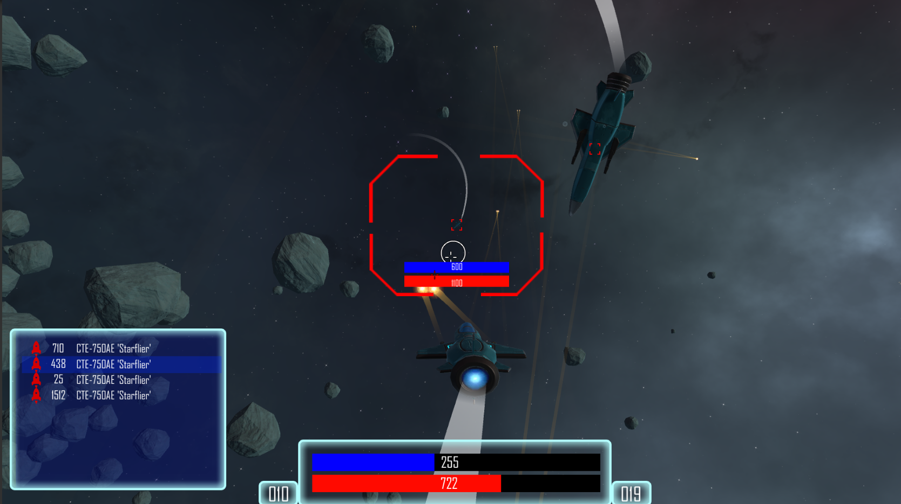

## Welcome to StarFire

StarFire will be a multiplayer space dogfighting game. A number of different weapons will be available, so you can customize your ship in fights to fit your particular style.

### Current Work

Currently we are working on the Single Player prototype. It will have these basic features:

-Moddable Ship/Equipment/Goods (through XML)
-Target list for the system
-Target Assist
-Ship Inventory where you can unequip/equip equipment and put to cargo bay. You can then sell it or buy upgrades at the station.
-Station Interaction. You will be able to contact different stations and buy items from there. Stations have different prices so you can trade items from one to the other to make a profit.
-Pirates. Enemy ships will appear to threaten you and will give chase.

### News

12-1-19:
Drag&Drop from Ship equipment slot to cargo and back again works. Albeit buggy.
You can buy new items at Station and equip them.

*Current Goals for the next few days are: 

-Bugfixes
-Upgrading our UIdisplay script so that it can be attached to multiple screens while changing no code, only inspector values. Its currently used to display infocard data when you hover over an item in the equipment slot.
-Cargo drops for loot when you destroy an enemy.
